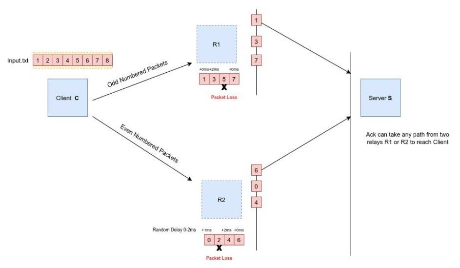

# File Transfer
The project is to code a program which allows a client to upload file to a server by mimicking two transfer protocols: **Multi-channel stop-and-wait protocol** and **Selective Repeat protocol over UDP**. The programs are written completely in C.

## Aim
- Understand multi-channel stop and wait protocol and SR protocol and learn to implement the same
- Understand TCP and UDP and their implementation in C (using various sys calls)
- Understand loss of packets (both Data and Ack packets) and learn how to simulate it in C
- Understand how buffering works, what are its advantages and how to simulate it in C
- Understand how multiple channels or clients can be created in C (using `fork()` sys call)

## Index
- [Directory structure](#directory-structure-index)
- [Architecture](#architecture-index)
- [Tech used](#tech-used-index)
- [Dev setup](#dev-setup-index)
- [How to run](#how-to-run-index)
- [Tests](#tests-index)

## Directory structure [[Index](#index)]
```bash
.
├── README.md
├── SR_Protocol
│   ├── Makefile
│   ├── SR-protocol.JPG
│   ├── client
│   ├── client.c
│   ├── getLog.sh
│   ├── input.txt
│   ├── log.txt
│   ├── log_client.txt
│   ├── log_relay1.txt
│   ├── log_relay2.txt
│   ├── log_server.txt
│   ├── output.txt
│   ├── packet.h
│   ├── readme.txt
│   ├── relay
│   ├── relay.c
│   ├── server
│   └── server.c
├── Specifications.pdf
└── Stop_Wait_Protocol
    ├── Makefile
    ├── Stop-and-wait.JPG
    ├── client
    ├── client.c
    ├── input.txt
    ├── output.txt
    ├── packet.h
    ├── readme.txt
    ├── server
    └── server.c
```
- [Specifications.pdf](Specifications.pdf) contains the complete specifications that have been implemented in the code
- [Multi-channel stop-and-wait protocol](Stop_Wait_Protocol) contains the code for implementation of the same
- [Selective Repeat protocol over UDP](SR_Protocol) contains the code for implementation of the same

## Architecture [[Index](#index)]
- **Multi-channel stop-and-wait protocol**


- **SR protocol over UDP**


## Tech used [[Index](#index)]
- C
- gcc

## Dev setup [[Index](#index)]
- If gcc isn't installed, you can install it using:
  ```bash
  sudo apt-get update
  sudo apt install gcc
  ```
## How to run [[Index](#index)]
***The specific running instructions for both protocols can be referred from [multi-channel stop-and-wait protocol](Stop_Wait_Protocol/readme.txt) and from [SR protocol over UDP](SR_Protocol/readme.txt). Both these files also have detailed instructions explaining the architecture, the complete logic of the code, procedure to generate and read log files, comparing input and output files and various specific features. I highly recommend you to go through them for detailed understanding. Nevertheless, for sake of completeness I've also put the instructions to run the code below along with the demo video.***

- **Multi-channel stop-and-wait protocol**
  1. `make`
  2. `./server` (In one instance of terminal)
  3. `./client` (In another instance of terminal)
  Refer to the `Note` and `Reading the log` sections of [multi-channel stop-and-wait protocol](Stop_Wait_Protocol/readme.txt) for more details.
  
- **SR protocol over UDP**
  1. `make`
  2. `./server`
  3. `./relay 1`   (To run relay node 1)
  4. `./relay 2`   (To run relay node 2)
  5. `./client`
  Run (ii)-(v) on separate terminal instances.
  Refer to the `Note` and `Reading the log` sections of [SR protocol over UDP](SR_Protocol/readme.txt) for more details.

## Tests [[Index](#index)]
You can test the working of the programs by using the sample input. 
- For Stop-and-wait protocol, refer to [input.txt](Stop_Wait_Protocol/input.txt) for sample input and [output.txt](Stop_Wait_Protocol/output.txt) for the output. The logs would be visible to the user on the terminal screen when s/he runs the program.
- For SR protocol, refer to [input.txt](SR_Protocol/input.txt) for sample input and [output.txt](SR_Protocol/output.txt) for the output. The complete log file sorted by time stamp is [log.txt](SR_Protocol/log.txt). Individual log files are also present in the [same folder](SR_Protocol). Also, these individual logs can also be seen on the terminal screen when the user runs the program.

***Note that user can change various setting like buffer size, timout, PDR (packet drop rate), etc in the file named `packet.h`. Do remeber to recompile your program once you change these settings.***
